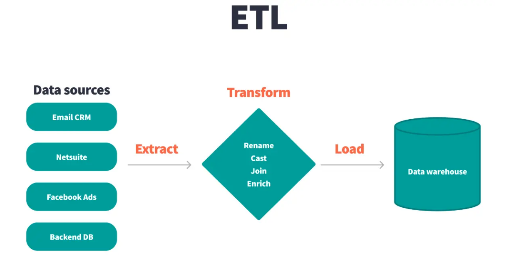
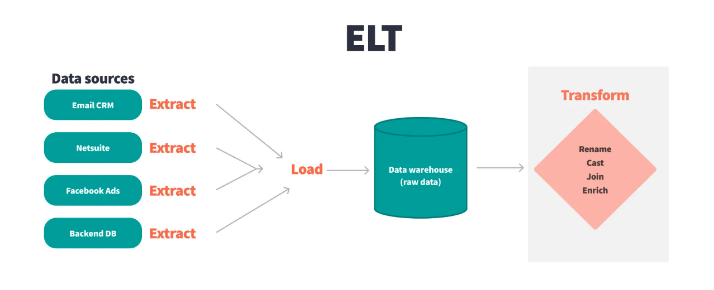

### 1. High-Level Summary

**The fundamental difference between ETL and ELT centers on when and where data transformation takes place within the data integration pipeline.** **In ETL, raw data is extracted, cleaned, and structured before being loaded into the target system, whereas in ELT, raw data is loaded directly into the data warehouse first and transformed afterwards using the warehouse's computational power.**

### ETL:

### ELT: 

---

### 2. Side-by-Side Comparison Matrix

| Criteria | ETL (Extract, Transform, Load) | ELT (Extract, Load, Transform) |
| :--- | :--- | :--- |
| **Pipeline Order** | Extract → Transform → Load | Extract → Load → Transform |
| **Transformation Location** | Outside the warehouse in a separate processing pipeline or downstream system | Inside the data warehouse using native computational power |
| **Best Suited Infrastructure** | Traditional on-premises hardware or specialized processing engines | Cloud-native data warehouses (e.g., Snowflake, BigQuery, Redshift) |
| **Data Availability Speed** | Slower, as data must be fully transformed before becoming queryable | Faster, as raw data is loaded immediately and made queryable with minimal delay |
| **Transformation Flexibility** | Less flexible; changing logic requires re-extracting or reprocessing entire datasets | Highly flexible and iterative; transformations can be updated on stored raw data without reloading |

---

### 3. Detailed Process Breakdown

#### **The ETL Process (Extract → Transform → Load)**
1. **Extract**: Data is pulled from various source systems, often originating in unstructured or semi-structured formats.
2. **Transform**: Extracted data undergoes cleaning, formatting, and structuring in an intermediate staging step to prepare it for analysis.
3. **Load**: The structured, transformed data is loaded into the target system (such as a data warehouse) where it becomes available for querying and reporting.

#### **The ELT Process (Extract → Load → Transform)**
1. **Extract**: Data is collected from various source systems, following the same initial collection step as ETL.
2. **Load**: Raw data is ingested directly into the target data warehouse without undergoing pre-load transformations.
3. **Transform**: Transformations are executed directly within the data warehouse after storage, leveraging the processing power of the cloud data platform.

---

### 4. Key Advantages of ELT in Modern Data Stacks

- **Cloud Infrastructure Utilization**: ELT capitalizes on the scalable, massive processing capabilities of cloud-native data warehouses (such as Snowflake, BigQuery, and Redshift) to handle transformations at scale.
- **Faster Data Availability**: Loading raw data immediately into the warehouse eliminates pre-processing delays, giving analysts rapid access to queryable data.
- **Cost Efficiency**: ELT optimizes costs by reducing the need for expensive on-premises processing hardware or dedicated transformation tools, capitalizing instead on cloud warehouse capabilities.
- **Iterative Transformation**: Because raw data is preserved directly in the warehouse, data engineers and analysts can transform data iteratively and adapt to changing requirements without reloading the source dataset.
- **Data Democratization**: Storing raw data upfront supports self-service analytics, empowering analysts across teams to access and transform data independently without bottlenecks from upstream ETL processes.

---

### 5. The Role of dbt in ELT Workflows

#### **Where dbt Fits into ELT**
**dbt operates as the transformation layer residing directly inside the data warehouse during an ELT workflow.** While ELT moves raw data into the warehouse, dbt empowers data teams to manage, structure, and automate the transformation process to produce clean, analytics-ready models.

#### **Core Features of dbt**
- **Version-Controlled Transformations**: Enables version control for all transformation models, making it easy to track historical changes, maintain organized transformations, and collaborate across teams.
- **Automation & Scheduling**: Automates the execution and scheduling of transformation models, ensuring analysts always have access to up-to-date data for analysis.
- **Comprehensive Testing**: Provides built-in testing capabilities to validate data quality and maintain data integrity throughout the ELT lifecycle.

